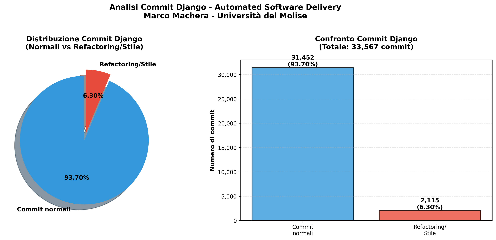

# 📊 Analisi Commit Django - Refactoring e Stile

[](https://tuousername.github.io/django-commit-analysis/)
[](https://www.python.org/)
[](LICENSE)

> Progetto universitario per il corso di **Automated Software Delivery**  
> **Università del Molise** - Prof. Simone Scalabrino  
> **Autore:** Marco Machera | **Anno:** 2025

---

## 🎯 Domanda di Ricerca

> **"Quanti commit di Django hanno migliorato lo stile del codice o hanno effettuato operazioni di refactoring?"**

---

## 📈 Risultati Principali

| Metrica | Valore |
|---------|--------|
| **Commit Totali Analizzati** | 33,567 |
| **Commit Refactoring/Stile** | 2,115 (6.30%) |
| **Commit Normali** | 31,452 (93.70%) |

### 💡 Insight Chiave

- ✅ **Circa 1 commit su 16** è dedicato al refactoring o allo stile
- ✅ **Django mantiene un forte impegno** per la qualità del codice
- ✅ **Il refactoring è una pratica costante**, integrata nel processo di sviluppo
- ✅ **Solo il 15.2% degli autori** contribuisce attivamente al refactoring
- ✅ **Adrian Holovaty** è il top contributor con 263 commit di refactoring

---

## 🌐 Report Interattivo

**[📊 Visualizza il Report Completo su GitHub Pages](https://tuousername.github.io/django-commit-analysis/)**

Il report include:
- 📊 Grafici interattivi (torta, barre, temporali)
- 👥 Top 10 contributori al refactoring
- 🔤 Analisi delle parole chiave più frequenti
- 📅 Evoluzione temporale (2005-2025)
- 📈 Statistiche comparative dettagliate

---

## 📁 Struttura del Progetto

```
django-commit-analysis/
├── 📊 Dati
│   ├── commits.csv                    # Dataset completo (33,567 commit)
│   └── commit_refactoring.csv         # Commit identificati (2,115)
│
├── 🐍 Script Python
│   ├── analisi_commit.py              # ⭐ Script principale
│   └── analisi_avanzate.py            # Analisi approfondite
│
├── 📈 Visualizzazioni
│   ├── grafico_commit.png             # Grafici principali
│   ├── analisi_temporale.png          # Evoluzione nel tempo
│   ├── top_autori_refactoring.png     # Top contributori
│   └── parole_chiave_frequenza.png    # Frequenza keywords
│
├── 🌐 Report Web
│   ├── index.html                     # GitHub Pages (report principale)
│   └── report_analisi.html            # Report completo
│
└── 📚 Documentazione
    ├── README.md                      # Questo file
    ├── GUIDA_USO.md                   # Istruzioni dettagliate
    ├── RIEPILOGO.md                   # Sintesi risultati
    └── STRUTTURA_PROGETTO.txt         # Organizzazione progetto
```

---

## 🚀 Quick Start

### 1. Clona il Repository

```bash
git clone https://github.com/tuousername/django-commit-analysis.git
cd django-commit-analysis
```

### 2. Installa le Dipendenze

```bash
pip install -r requirements.txt
```

### 3. Esegui l'Analisi

```bash
# Analisi base
python3 analisi_commit.py

# Analisi avanzate
python3 analisi_avanzate.py
```

### 4. Visualizza i Risultati

```bash
# Apri il report nel browser
open index.html
```

---

## 📊 Visualizzazioni

### Distribuzione Commit


### Analisi Temporale


### Top Autori


### Frequenza Parole Chiave


---

## 🛠️ Metodologia

### 1. Estrazione Dati
```bash
cd django
git log --pretty=format:"%H;%an;%ad;%s" > ../commits.csv
```

### 2. Identificazione Commit di Refactoring

Lo script identifica commit di refactoring cercando parole chiave come:
- `refactor`, `cleanup`, `reformat`, `style`
- `pep8`, `lint`, `typo`, `naming`
- `readability`, `simplify`, `optimize`
- `formatting`, `cosmetic`, `whitespace`
- E altre 10+ parole chiave...

### 3. Analisi e Visualizzazione

- **pandas** per l'analisi dei dati
- **matplotlib** per le visualizzazioni
- **HTML/CSS** per il report interattivo

---

## 📚 Documentazione Completa

- **[GUIDA_USO.md](GUIDA_USO.md)** - Istruzioni dettagliate per l'uso
- **[RIEPILOGO.md](RIEPILOGO.md)** - Sintesi completa dei risultati
- **[STRUTTURA_PROGETTO.txt](STRUTTURA_PROGETTO.txt)** - Organizzazione del progetto

---

## 🎓 Contesto Accademico

Questo progetto è stato sviluppato per il corso di **Automated Software Delivery** presso l'**Università del Molise**, tenuto dal **Prof. Simone Scalabrino**.

L'obiettivo è analizzare empiricamente la storia del repository [Django](https://github.com/django/django) per comprendere quanto impegno viene dedicato al refactoring e al miglioramento della qualità del codice.

---

## 🏆 Risultati Dettagliati

### Top 10 Contributori al Refactoring

| # | Autore | Commit |
|---|--------|--------|
| 🥇 | Adrian Holovaty | 263 |
| 🥈 | Tim Graham | 198 |
| 🥉 | Russell Keith-Magee | 150 |
| 4 | Malcolm Tredinnick | 141 |
| 5 | Mariusz Felisiak | 75 |
| 6 | Aymeric Augustin | 66 |
| 7 | Gary Wilson Jr | 62 |
| 8 | Alex Gaynor | 56 |
| 9 | Jannis Leidel | 48 |
| 10 | James Bennett | 43 |

### Parole Chiave Più Frequenti

| Parola | Occorrenze |
|--------|------------|
| typo | 1,326 |
| formatting | 196 |
| style | 173 |
| cleanup | 94 |
| whitespace | 71 |

### Evoluzione Temporale (Top 5 Anni)

| Anno | Commit Refactoring |
|------|--------------------|
| 2008 | 205 |
| 2007 | 178 |
| 2013 | 166 |
| 2014 | 164 |
| 2010 | 155 |

---

## 💻 Tecnologie Utilizzate


---

## 📄 Licenza

Questo progetto è rilasciato sotto licenza MIT. Vedi il file [LICENSE](LICENSE) per i dettagli.

---

## 👤 Autore

**Marco Machera**
- 🎓 Università del Molise

---

## 📊 Statistiche Repository


---